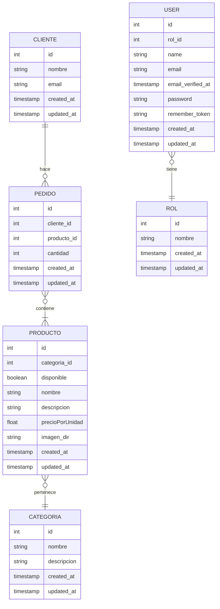

# Proyecto Inicial - 🐄🧑‍🌾 shopping de la granja 🥩🥛

## Idea a Implementar 💡

La idea es realizar un aplicacion que permita administrar un catalogo de productos de la granja, donde se pueden buscar ciertos productos segun alguna palabra clave o caracteristica, y tambien reservar uno o varios productos usando un carrito de compras.

## Diagrama ER 👷

## Actualizaciones a los datos ✏️

### Proyecto Framework PHP - Laravel

usuarios con rol "user":
  * solo puede ver el Home

usuarios con rol "ventas" podran:
  * ver productos.
  * ver clientes.
  * ver pedidos.
  
usuarios con rol "actualizacion" podran:
  * editar la disponibilidad e imagen de los productos.

usuarios con rol "edicion" podran:
  * cargar, borrar y editar productos.
  * cargar, borrar y editar categorias.
  * cargar, borrar y editar clientes.
  * cargar, borrar y editar pedidos.
    
usuarios con rol "administrador" podran:
  * administar usuarios
  * ver timestamps de cuando fueron creados/actualizados los:
     * Productos
     * Categorias
     * Clientes
     * Pedidos
     * Usuarios     
  * lo mismo que el rol "edicion"

## Información del Servicio Web 📰

El Servicio Web permitira inspeccionar y reservar productos relacionados con la granja, se pueden buscar según:
  * Categoria
  * Precio -> mayor/menor
  * Palabra clave
  * Disponibilidad

## Visualización y Acceso a la Información 👀

### Proyecto Javascript - React/Vue

El usuario para buscar productos de la manera mas intuitiva posible,
navegando con el mouse o ingresando texto por teclado podrá:
  * Scrollear a traves del catagolo de categorias
  * Ver productos de una categoria
  * Buscar algun producto especifico segun palabra clave
  * Ordenar segun precio ascendente/descendente
  * Ordenar segun nombre ascendente/descendente
  * Agregar productos al carrito de compras
  * Autenticarse en la Aplicacion Web, es decir, login/registro
  * Realizar un pedido
  * Ver "mis pedidos"
